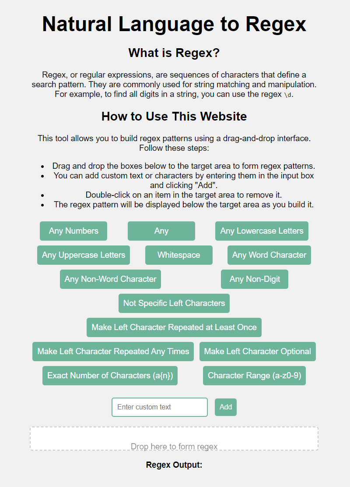

# 🎉 Drag and Drop Regex Converter 🎉

Welcome to the **Drag and Drop Regex Converter**! This tool helps you build regular expression patterns using a user-friendly drag-and-drop interface.

## 📖 What is Regex?

Regex, or regular expressions, are sequences of characters that define a search pattern. They are commonly used for string matching and manipulation. For example, to find all digits in a string, you can use the regex `\d`.

## 🌐 Live Demo

Check out the live demo of this project here: [Natural Language to Regex](http://natural-language-to-regex.s3-website.us-east-2.amazonaws.com/)

## 🛠️ How to Use This Website

This tool allows you to build regex patterns using a drag-and-drop interface. Follow these steps:

1. **Drag and Drop**: Drag and drop the boxes below to the target area to form regex patterns.
2. **Custom Text**: Add custom text or characters by entering them in the input box and clicking "Add".
3. **Remove Items**: Double-click on an item in the target area to remove it.
4. **View Regex**: The regex pattern will be displayed below the target area as you build it.

## 💻 Installation and Setup

To set up this project locally, follow these steps:

1. **Clone the repository**:
    ```sh
    git clone https://github.com/Kpewww/Natural-Language-to-Regex.git
    ```
2. **Navigate to the project directory**:
    ```sh
    cd Natural-Language-to-Regex
    ```
3. **Open `index.html` in your favorite web browser**.

## 📝 Features

- **Drag-and-Drop Interface**: Easily build regex patterns by dragging predefined elements.
- **Custom Inputs**: Add custom regex elements using the input box.
- **Real-time Output**: View the resulting regex pattern as you build it.
- **Error Handling**: Prompts for valid input when customizing character ranges or exact repetitions.

## 🔧 Technologies Used

- **HTML**
- **CSS**
- **JavaScript**
- **jQuery**
- **jQuery UI**

## 📸 Screenshots



## 🐛 Reporting Issues

If you encounter any issues or have suggestions for improvement, feel free to open an issue on the [GitHub repository](https://github.com/Kpewww/Natural-Language-to-Regex/issues).
I am really appreciate to have your advice and make the website better!

## 📄 License

This project is licensed under the MIT License. See the [LICENSE](LICENSE) file for details.

## 👏 Acknowledgments

Thank you for using the Drag and Drop Regex Converter! We hope you find it helpful for building your regex patterns.

---

🚀 **Happy Regex Building!** 🚀
